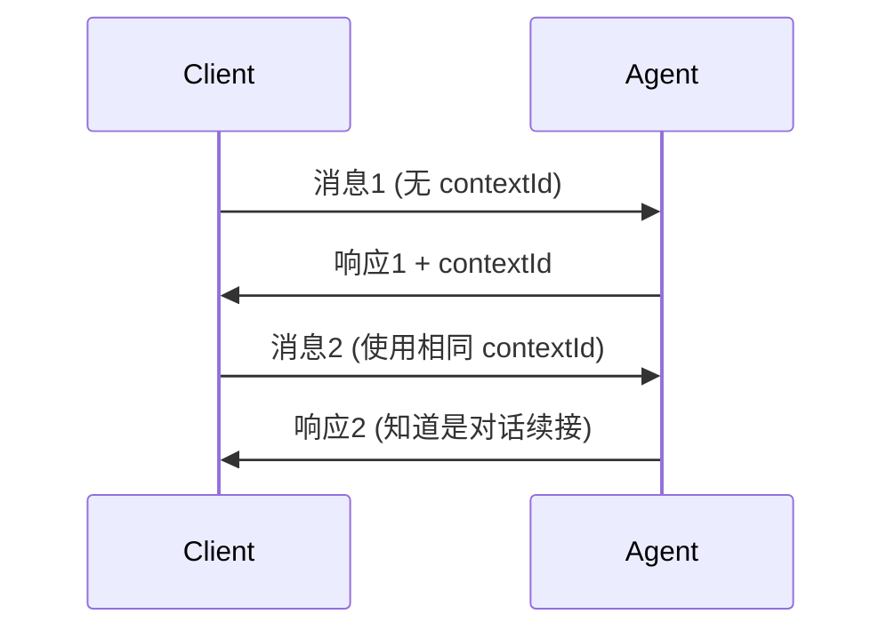

# A2A 协议核心概念

## 概述

A2A (Agent-to-Agent) 协议是一个开放标准，让不同组织、不同技术栈开发的 AI Agent 能够互相发现、通信和协作。

## 为什么需要 A2A？

### 问题

在 AI Agent 生态中，存在大量孤立的 Agent：
- 不同公司开发的 Agent 无法互操作
- 每个 Agent 都有自己的 API 格式
- 缺乏标准化的能力发现机制
- 多 Agent 协作需要定制化集成

### 解决方案

A2A 提供：
1. **标准化能力发现** - Agent Card
2. **标准化通信协议** - JSON-RPC over HTTP
3. **标准化任务管理** - Task 生命周期
4. **多模态支持** - 文本、文件、结构化数据

## 核心组件

### 1. Agent Card (代理名片)

Agent Card 是 Agent 的"数字名片"，描述：
- Agent 的身份和能力
- 如何连接和认证
- 支持的交互模式

**获取方式**：
```
GET /.well-known/agent.json
```

**结构**：
```json
{
  "name": "Agent 名称",
  "description": "Agent 描述",
  "version": "1.0.0",
  "capabilities": {
    "streaming": true,
    "push_notifications": true,
    "extended_agent_card": true
  },
  "defaultInputModes": ["text", "application/json"],
  "defaultOutputModes": ["text", "application/json"],
  "skills": [...],
  "supported_interfaces": [...],
  "securitySchemes": {...},
  "url": "https://agent.example.com/"
}
```

**关键字段**：

| 字段 | 说明 |
|------|------|
| `name` | Agent 名称 |
| `description` | Agent 功能描述 |
| `capabilities` | 支持的能力 |
| `skills` | Agent 提供的技能列表 |
| `supported_interfaces` | 连接方式 |
| `securitySchemes` | 认证方案 |

### 2. JSON-RPC 通信

A2A 使用 JSON-RPC 2.0 over HTTP 进行通信。

**请求格式**：
```json
{
  "jsonrpc": "2.0",
  "id": 1,
  "method": "message/send",
  "params": {
    "message": {...}
  }
}
```

**响应格式（成功）**：
```json
{
  "jsonrpc": "2.0",
  "id": 1,
  "result": {...}
}
```

**响应格式（错误）**：
```json
{
  "jsonrpc": "2.0",
  "id": 1,
  "error": {
    "code": -32601,
    "message": "Method not found"
  }
}
```

### 3. 消息结构

**Message 结构**：
```json
{
  "role": "user",
  "parts": [...],
  "messageId": "uuid",
  "contextId": "uuid",
  "taskId": "uuid"
}
```

**Part 类型**：

| kind | 用途 | 示例 |
|------|------|------|
| `text` | 文本内容 | `{"kind": "text", "text": "hello"}` |
| `file` | 文件传输 | `{"kind": "file", "file": {"name": "...", "bytes": "base64"}}` |
| `data` | 结构化数据 | `{"kind": "data", "data": {"key": "value"}}` |

### 4. Task 生命周期

Task 是 A2A 中的核心概念，代表一个工作单元。

**状态流转**：
```
submitted → working → completed
                  ↘ input-required
                  ↘ cancelled
```

**状态说明**：

| 状态 | 说明 |
|------|------|
| `submitted` | 任务已提交 |
| `working` | 任务执行中 |
| `completed` | 任务已完成 |
| `input-required` | 需要更多输入 |
| `cancelled` | 任务已取消 |

### 5. 多轮对话

使用 `contextId` 维护会话上下文：



### 6. 流式响应

使用 `message/stream` 方法和 SSE (Server-Sent Events)：

**请求**：
```json
{
  "method": "message/stream",
  "params": {...}
}
```

**响应** (SSE 格式)：
```
data: {"result": {"kind": "artifact-update", ...}}
data: {"result": {"kind": "artifact-update", ...}}
data: {"result": {"kind": "status-update", "status": {"state": "completed"}}}
```

## API 方法

### message/send

发送消息并等待响应。

**请求**：
```json
{
  "jsonrpc": "2.0",
  "id": 1,
  "method": "message/send",
  "params": {
    "message": {
      "role": "user",
      "parts": [{"kind": "text", "text": "hello"}],
      "messageId": "uuid"
    }
  }
}
```

### message/stream

发送消息并接收流式响应。

### tasks/get

查询任务状态。

**请求**：
```json
{
  "method": "tasks/get",
  "params": {"id": "task-uuid"}
}
```

### tasks/cancel

取消任务。

## 与 MCP 的关系

| 协议 | 解决的问题 | 类比 |
|------|-----------|------|
| **A2A** | Agent 之间的通信和协作 | Agent 的"HTTP" |
| **MCP** | Agent 与工具/数据源的连接 | Agent 的"USB" |

两者是互补关系，可以组合使用：
- MCP 让 Agent 连接工具和数据
- A2A 让 Agent 之间协作

## 安全考虑

### 认证

Agent Card 中声明 `securitySchemes`：

```json
{
  "securitySchemes": {
    "bearer": {
      "type": "http",
      "scheme": "bearer"
    },
    "oauth2": {
      "type": "oauth2",
      "flows": {...}
    }
  }
}
```

### 扩展 Agent Card

对于需要认证才能看到的敏感能力，使用扩展 Agent Card：

```bash
GET /a2a/agent/authenticatedExtendedCard
Authorization: Bearer <token>
```

### 安全最佳实践

1. **验证所有输入** - Agent Card、消息内容都可能是恶意的
2. **防止 Prompt 注入** - 不要直接将外部内容嵌入 prompt
3. **使用 HTTPS** - 生产环境必须使用加密传输
4. **限制权限** - 遵循最小权限原则

## 下一步

- 查看 [03-examples.md](03-examples.md) 了解代码示例
- 运行 `/a2a-practice` 启动本地服务
- 查看 [references/protocol-spec.md](references/protocol-spec.md) 了解完整规范
